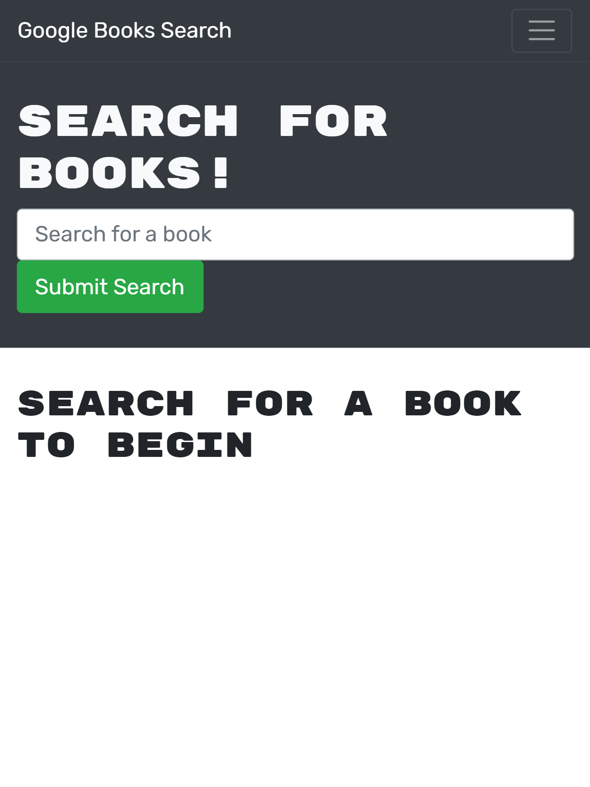

# Book Search Engine


  ## Description
  Acceptance Criteria:

  ```
GIVEN a book search engine
WHEN I load the search engine
THEN I am presented with a menu with the options Search for Books and Login/Signup and an input field to search for books and a submit button
WHEN I click on the Search for Books menu option
THEN I am presented with an input field to search for books and a submit button
WHEN I am not logged in and enter a search term in the input field and click the submit button
THEN I am presented with several search results, each featuring a book’s title, author, description, image, and a link to that book on the Google Books site
WHEN I click on the Login/Signup menu option
THEN a modal appears on the screen with a toggle between the option to log in or sign up
WHEN the toggle is set to Signup
THEN I am presented with three inputs for a username, an email address, and a password, and a signup button
WHEN the toggle is set to Login
THEN I am presented with two inputs for an email address and a password and login button
WHEN I enter a valid email address and create a password and click on the signup button
THEN my user account is created and I am logged in to the site
WHEN I enter my account’s email address and password and click on the login button
THEN I the modal closes and I am logged in to the site
WHEN I am logged in to the site
THEN the menu options change to Search for Books, an option to see my saved books, and Logout
WHEN I am logged in and enter a search term in the input field and click the submit button
THEN I am presented with several search results, each featuring a book’s title, author, description, image, and a link to that book on the Google Books site and a button to save a book to my account
WHEN I click on the Save button on a book
THEN that book’s information is saved to my account
WHEN I click on the option to see my saved books
THEN I am presented with all of the books I have saved to my account, each featuring the book’s title, author, description, image, and a link to that book on the Google Books site and a button to remove a book from my account
WHEN I click on the Remove button on a book
THEN that book is deleted from my saved books list
WHEN I click on the Logout button
THEN I am logged out of the site and presented with a menu with the options Search for Books and Login/Signup and an input field to search for books and a submit button   
```

  ## Table of Contents
  - [Description](#description)
  - [Installation](#installation)
  - [Usage](#usage)
  - [License](#license)
  - [Credits](#credits)

  ## Installation
  `npm i` 

  ## Usage

  In the project directory, you can run: `npm start` or `npm run develop`

  Runs the app in the development mode.\
  Open [http://localhost:3000](http://localhost:3000) to view it in the browser.

  The page will reload if you make edits.\
  You will also see any lint errors in the console.

  Running `npm run build` builds the app for production to the `build` folder.\
  It correctly bundles React in production mode and optimizes the build for the best performance.

  The build is minified and the filenames include the hashes.\
  Your app is ready to be deployed!

  Below is a screenshot of the [deployed application](https://shocking-beast-74088.herokuapp.com/): 

   

  ## License
  This application is covered by [MIT](https://opensource.org/licenses/MIT) license. 
  
  ## Credits: 
  https://courses.bootcampspot.com/
